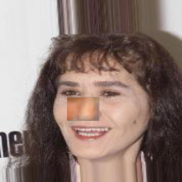
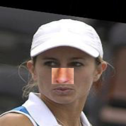
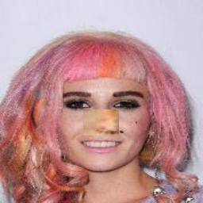
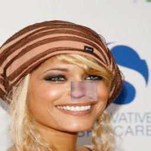
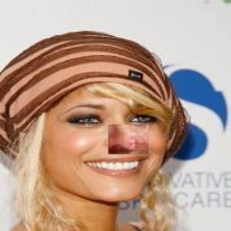
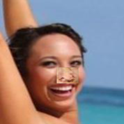

## Nose-Replacement
# Description
This project is a machine learning project that learns to recognize noses according to pre determined dataset with nose indices and then replace the noses between two pictures

# How to start
1. Download the images dataset from <a href="https://drive.google.com/open?id=0B7EVK8r0v71pWEZsZE9oNnFzTm8">HERE</a>
2. Extract the pictures and set them into the *** folder
3. Change the paths in the `train_options.py` to align to your computer running the code
4. Install the needed python module in the `requirements.txt` file (Using: `pip install -r requirements.txt`)

Now you are ready to let the code learn to recognize noses:
* Run the following command `python train.py` and let it run

Once finished you should run `python test.py --image1 <first image location> --image2 <second image location>` and the output will be in the `results` folder 
*NOTE:* Replace the `first/second image location` with the location of the pictures you want to replace their noses

# Output example
<table>
 <tr>
<td></td>
<td></td>
</tr>
<tr>
<td></td>
<td></td>
</tr>
<tr>
<td></td>
<td></td>
</tr>
<tr>
<td></td>
<td></td>
</tr>
<tr>
<td></td>
<td></td>
</tr>
</table>

# License
This work is licensed under a <a href="http://creativecommons.org/licenses/by-nc/4.0/">Creative Commons Attribution-NonCommercial 4.0 International License</a>.

# Resources
In this project we used the following project:
<a href="https://github.com/lyndonzheng/Pluralistic-Inpainting">Pluralistic Inpainting</a>
